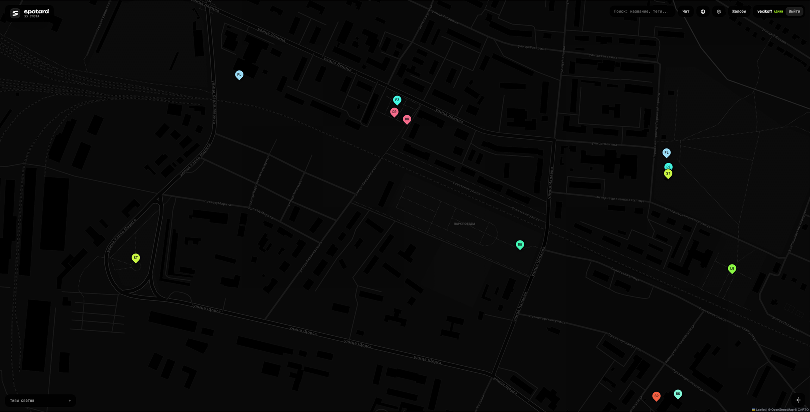

# Spotard

Карта спотов для скейтеров, BMX, самокатчиков и других райдеров. Находи места для катания в своём городе и делись своими любимыми точками с другими.

## Скриншоты

## Функционал

- Карта спотов — смотри где кататься в твоём городе
- Фото спотов — загружай фотографии чтобы показать как выглядит место
- Лайки — отмечай любимые споты
- Комментарии — обсуждай споты с другими райдерами
- Система жалоб — сообщай о неактуальных спотах
- Типы спотов — фильтруй по типу (скейт, BMX, самокат, дерт и т.д.)
- Мгновенные обновления — новые споты появляются сразу у всех (WebSocket/Pusher)
- Поиск — находи споты по названию и тегам

## Использование

Открыть карту: https://t.me/spotard_bot/open

Сайт: spotard.claus-maslov.space

## Технологии

- Frontend: HTML, CSS, JavaScript
- Backend: Python
- Real-time: Pusher (WebSocket)
- База данных: SQLite
- Хостинг: Cloudflare Pages

## Telegram бот

[spotard_bot](https://t.me/spotard_bot/open) — для быстрого доступа к карте

## В разработке

- Система кулдаунов на действия

## Авторы

- [Vexikoff](https://github.com/vexikoff)
- [Claus_Maslov](https://github.com/Claus-Maslov)
